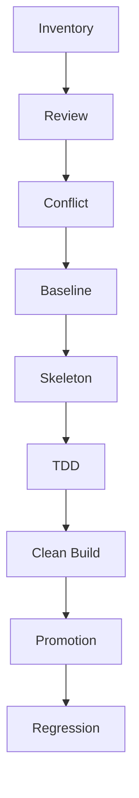
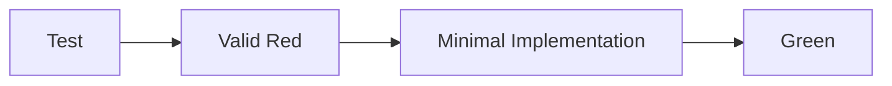
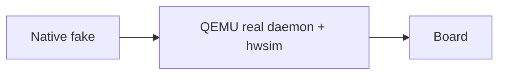

# Project Bootstrap — Docs First

## Trigger

Use for C/Embedded bootstrap/rebuild, public-contract establishment, host-build integration, contract testing, and Native/Simulation/Board validation.

Skip pure Q&A, isolated edits, unconstrained PoC work, and local bugfixes that do not change project boundaries.

## Execution



A boundary advances only when its current Gate is `READY`.

States:

```text
OPEN | BLOCKED | READY | RESOLVED | ACCEPTED-RISK | ESCALATED
```

Local problems block only the affected boundary.

---

# Global Rules

## Sources

**Normative:** architecture/design docs, API/ownership/lifetime/threading contracts, compatibility requirements, validation criteria, explicit project/user decisions.

**Evidence:** host API/ABI, legacy/reference code, build/toolchain, tests, runtime/log/trace/crash, simulation/board behavior.

> Design defines the target; evidence constrains implementation.

Never guess public API, ownership, lifetime, threading, ABI, or validation behavior.

## Evidence Confidence

Keep distinct:

```text
Observed → Hypothesis → Verified Cause
```

A verified symptom does not verify its suspected cause.

## Blocking Gap

If continuing requires inventing any of:

```text
public API
ownership/lifetime
threading/async
ABI compatibility
required behavior
validation success criteria
```

mark:

```text
Status: BLOCKED(<boundary>)
```

A blocked boundary may be investigated, but its contract, real implementation, contract tests, and promotion must not advance.

---

# Gate 0 — Workspace Inventory

Scan workspace before asking the user for materials.

Look for:

```text
docs/design/architecture
include/src
legacy/reference
tests
build/cmake
scripts/tools
README* CLAUDE.md AGENTS.md
```

Record:

| Input | Status |
|---|---|
| Architecture | OK/Missing/N/A/TO-CREATE |
| API Contract | OK/Missing/N/A/TO-CREATE |
| Host ABI/API | OK/Missing/N/A |
| Reference/Legacy | OK/Missing/N/A |
| Tests | OK/Partial/TO-CREATE/N/A |
| Validation | OK/Partial/TO-CREATE/N/A |

`TO-CREATE` means this task creates it; `N/A` means this boundary does not need it.

**Exit:** required sources are located or explicitly `N/A/TO-CREATE`, and the current boundary has no Blocking Gap. Otherwise that boundary stays `BLOCKED`; unaffected boundaries may continue.

---

# Gate 1 — Source Review

Review every source that can change the current contract:

```text
architecture/API
ownership/lifetime/threading
host API/ABI
compatibility
relevant legacy/reference
relevant tests
validation criteria
```

Evidence:

```text
Reviewed: <paths>
N/A: <items>
Blocking gaps: <none/list>
```

Before `READY`, confirm module purpose, public boundary, ownership/lifetime, threading/async, ABI/API compatibility, validation success criteria, and deferred/out-of-scope behavior.

Any unresolved contract-relevant item blocks the boundary.

---

# Gate 2 — Conflict Closure

Compare:

```text
docs ↔ headers ↔ legacy/reference ↔ host ABI/API ↔ tests ↔ runtime
```

Rules:

| Conflict | Default |
|---|---|
| Docs vs Agent guess | Docs |
| Docs vs legacy detail | Docs unless compatibility requires otherwise |
| Docs vs host ABI/API | BLOCK |
| Docs vs docs | BLOCK |
| Reference vs reproducible runtime | Runtime describes actual behavior; record mismatch |
| Test vs contract | Identify whether test, implementation, or contract is wrong |
| Memory vs project | Project source |

Each real conflict needs:

```text
ID / Boundary / Sources / Impact / Status
Resolution / Owner / Approval-Evidence / Recheck
```

Agent judgment alone cannot approve a normative conflict.

**Exit:** no `OPEN` conflict; each resolution/risk has an owner, evidence/approval, and recheck.

---

# Gate 3 — Contract Baseline

Freeze means:

> API changes follow Docs → Contract → Implementation.

It does not mean “never change”.

Cover only project-required contract semantics: signatures/types, ownership/lifetime, states, threading/reentrancy, callbacks/sync-async, errors, capacity/truncation, compatibility.

Do not impose a particular context model, ownership style, allocation strategy, singleton pattern, or network abstraction.

Baseline:

```text
Baseline ID
Normative docs
Public headers
Host ABI/API
Compatibility constraints
Validation contract
Revision/commit or snapshot/checksum
```

Consistency:

```text
Docs → Public Headers → Implementation Declarations
→ Real Implementation → Contract Tests
```

Check semantics, not just symbols.

Contract change:

```text
update normative source
→ reopen Gate 2
→ resolve conflicts
→ Gate 2 = READY
→ update baseline
→ header
→ implementation/tests
```

**Never update the baseline before Gate 2 returns to READY.**

Reopen/block if source revisions diverge, headers drift, host ABI or validation contract changes, or a conflict reopens.

---

# Gate 4 — Buildable Skeleton

Create only minimum compile/link structure:

```text
internal declarations/state
backend boundary
lifecycle/error shell
build wiring
```

Unimplemented APIs must return an explicit project state such as:

```text
NOT_IMPLEMENTED / NOT_INIT / NOT_SUPPORTED / ENOSYS
```

Do not return `OK` unless the contract defines the no-op as success.

> Stub may be build-green, never fake behavior-green.

**Exit:** compile/link succeed, stubs do not fake success, public contract has not drifted.

---

# Gate 5 — Contract TDD



Valid Red requires healthy test infrastructure and failure caused by missing contract behavior.

These are infrastructure failures, not Contract Red:

```text
SIGSEGV / abort / ASan / UBSan
fixture corruption / fake overflow
build/link failure
```

Mark:

```text
Status: TEST-INFRA-BLOCKED
```

Keep:

```text
Failure ID
reproduction command
failure output
stack/sanitizer evidence
suspected layer
Verified Cause
```

Until Verified Cause exists, do not change assertions, delete tests, or assume test/DUT fault.

System boundaries must be test-replaceable using project mechanisms where possible: ops table, DI, wrapper, link fake, weak symbol, test implementation, existing mock. Weak symbols are optional.

**Exit:** at least one valid Red→Green path, P0 contract tests green, no `TEST-INFRA-BLOCKED`, tests match baseline.

---

# Gate 6 — Clean Build Verification

> **Single Source of Build Truth**

Reuse the host's native build mechanism. Symlink is optional.

Require two proofs:

### Source-fresh

Prefer fresh checkout or fresh worktree from the recorded revision.

A normal clean worktree is equivalent only if it proves:

```text
tracked files == recorded revision
no untracked/generated dependency
```

### Build-clean

Use a fully cleaned build/output directory.

Build-clean does not replace Source-fresh.

If Source-fresh is objectively unavailable:

```text
Exception ID
Reason
Alternative evidence
Owner
Approval/Evidence
Residual risk
```

Agent judgment alone cannot approve the exception.

Build evidence:

```text
revision
toolchain identity/version
clean/configure/build/test commands
artifact
result
```

**Exit:** Source-fresh or approved equivalent + Build-clean + repeatable tests + artifact→revision traceability.

---

# Gate 7 — Layer Promotion

Choose validation layers by risk; QEMU/Simulation is not universally mandatory.


Every used layer needs Entry, Evidence, Exit, and Remaining Risks.

## Host

Entry: Gate 6 READY; Host contract has baseline; tests/fakes work; no `TEST-INFRA-BLOCKED`.

Scope: logic, parser, ownership, state machine, errors, deterministic behavior.

Evidence: revision, test command, result, planned sanitizer/static results.

Remaining Risks: system boundaries not covered by Host.

Exit: tests green; planned sanitizer/static checks pass; no unexplained crash or OPEN P0/P1 software defect.

## Simulation

Entry: Host Exit reached; Host-unverifiable system boundary identified; scenario/success criteria defined; environment maps to revision/artifact.

Scope: kernel, daemon, IPC, filesystem, network stack, virtual device, architecture-specific behavior.

Evidence: revision/artifact, environment identity, setup command, scenario command, result.

Remaining Risks: board-only risks and system boundaries not covered by Simulation.

If the contract depends on such a boundary and Simulation can provide repeatable evidence:

> **Simulation is a hard Gate.**

Skipping requires:

```text
Reason
Evidence
Residual risk
```

Exit: required boundary/scenario repeats reliably; P0/P1 simulation failures closed; board-only risks identified.

## Board

Entry must state:

```text
Why board
Remaining risks
Required evidence
Artifact/revision
```

Do not “just try it on the board”.

Scope: vendor driver, real hardware/RF, timing, CPU/RAM, DMA/cache/alignment, hardware lifecycle.

Exit: target acceptance executed; evidence maps to revision/artifact; software bugs moved to Host/Simulation regressions; hardware-only issues become tests/known constraints.

---

# Gate 8 — Regression Closure

Every issue ends in:

```text
FIXED + REGRESSION
KNOWN-CONSTRAINT
ACCEPTED-RISK
ESCALATED
```

Never rerun until a failure disappears.

Default flaky/unknown retry limit = 3 unless the project defines another value. After the limit:

```text
Status: ESCALATED
```

Record:

```text
ID / Observed / Reproduction count / Evidence
Hypothesis / Verified Cause / Final Status
Regression-or-Constraint / Owner
```

Put regressions at the lowest-cost stable layer:

```text
Board parser bug → Host
Simulation daemon bug → Simulation
Vendor RF anomaly → Board/Known Constraint
```

**Bootstrap Exit:** P0/P1 issues have valid final states; software fixes have regressions; hardware limits have tests/constraints; no ownerless OPEN conflict; all ESCALATED items have owners.

---

# Memory

Memory is an `Index / Cache / Entry Point`, not canonical specification.

Canonical facts come from current:

```text
docs + code + tests + validation scripts
```

Store only boundaries, canonical entry points, verified facts, and pitfall/environment indexes. Do not duplicate volatile contracts or commands already encoded in scripts.

On conflict:

```text
current project source wins → update memory
```

---

# Project-Specific Example — Embedded Linux Network

> Example only; never promote automatically to a universal rule.

If the project contract hides `wpa_ctrl`, ARP/NDP internals, `AF_INET/AF_INET6`, or keeps IPv4/IPv6 separate, preserve those decisions.

Weak-symbol fakes are valid only when they fit the project; prefer existing ops-table/DI mechanisms when present.

For `wpa_supplicant + hostapd + mac80211_hwsim`, a project may use:



QEMU is a hard Gate only when required by that project's validation contract.

For QEMU 9p failures, inspect:

```text
QEMU args → fsdev/virtfs → mount tag → guest capability
→ transport → mount options → host path/permission
```

Do not infer “kernel transport missing” from the symptom alone.

---

# Quick Decisions

| Situation | Action |
|---|---|
| Materials unknown | Inventory first |
| API contract is being created | `TO-CREATE` |
| ownership/ABI/validation unknown | BLOCK boundary |
| OPEN conflict | No baseline |
| Gate 2 not READY after contract change | Do not update baseline |
| Stub unfinished | Explicit not-implemented state |
| SIGSEGV/Sanitizer in tests | `TEST-INFRA-BLOCKED` |
| Incremental build works | Still require Source-fresh + Build-clean |
| Fresh checkout unavailable | Owner + Approval for alternative evidence |
| Current validation layer not exited | No promotion |
| Board finds software bug | Move regression downward |
| Flaky exceeds retry limit | ESCALATE |
| Memory conflicts with project | Project source wins |
